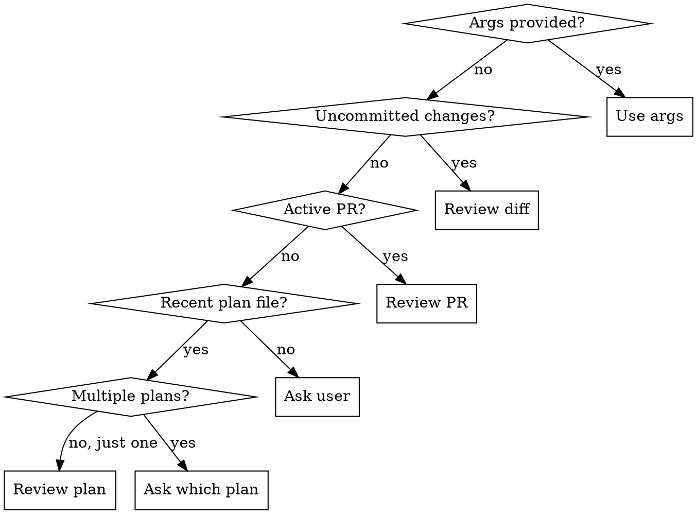

# Codex Tribunal Review

## Overview

Three independent reviewers — Codex (coding specialist), Gemini (wide-context), and Claude (codebase-aware) — each review the artifact in parallel. Claude merges findings using weighted consensus, runs a single targeted debate round on contested issues, and escalates unresolved items to the user.

**Core principle:** Three models with different architectures and context windows catch more than any single reviewer. Codex and Claude are trusted reviewers (weight 1.0); Gemini is advisory (weight 0.5) — it can surface issues but cannot alone force consensus.

### Reviewer Strengths

| Reviewer | Weight | Specialty Focus | Context |
|----------|--------|----------------|---------|
| **Codex** (gpt-5.3-codex) | 1.0 | BUG DETECTION: edge cases, off-by-one, null/undefined, race conditions, incorrect logic, boundary failures | Sees changed files + immediate context |
| **Gemini** | 0.5 | CROSS-FILE CONSISTENCY: API contract mismatches, import graph issues, architectural pattern violations, dead code, interface drift | Sees full file contents + tests + imports — feed it MORE |
| **Claude** | 1.0 | INTEGRATION CORRECTNESS: CLAUDE.md compliance, test coverage gaps, call-site impact analysis, integration correctness | Full repo via tools |

**Note:** Each reviewer reports ALL issues, not just their specialty. The specialty focus directs attention but does not restrict scope.

**Weight rules:**
- Codex + Claude agree → consensus (regardless of Gemini)
- Codex + Gemini agree → consensus (combined weight 1.5 ≥ 1.0 threshold)
- Claude + Gemini agree → consensus (combined weight 1.5 ≥ 1.0 threshold)
- Gemini alone → contested (weight 0.5 < 1.0 threshold) — needs debate
- Any single trusted reviewer alone → contested — needs debate

## When to Use

- After writing code (before commit)
- After finalizing a plan or design doc
- Before creating or merging a PR
- When you want a second opinion on architecture, logic, or approach
- **Mandatory** for all superpowers that produce artifacts (see Integration section)

When NOT to use:
- Trivial single-line fixes (typo, import reorder)
- Pure research/exploration tasks
- When Codex CLI is not installed
- **Bootstrap exception:** When modifying the codex-review skill itself, use a direct `codex exec review` one-pass instead of the full skill loop

## Prerequisites Check

Before starting, verify available tools:

```bash
# Check Codex CLI installed
which codex && codex --version

# Check Gemini CLI installed
which gemini && gemini --version
```

| Availability | Behavior |
|-------------|----------|
| Both Codex + Gemini | Full tribunal (3-way weighted) |
| Codex only (Gemini unavailable) | Bilateral mode (Codex + Claude, 2-way) |
| Gemini only (Codex unavailable) | Bilateral mode (Gemini + Claude, 2-way, Gemini upgraded to weight 1.0) |
| Neither available | Claude-only review with warning |

## Context Detection



### Detection Commands

```bash
# Check for uncommitted changes (includes untracked)
git status --short

# Check for active PR on current branch
gh pr view --json number,title,body,baseRefName 2>/dev/null

# Check for today's plan files (if multiple, ask user which one)
ls docs/plans/$(date +%Y-%m-%d)* 2>/dev/null
```

### Context Strategy (Per Reviewer)

Each reviewer gets different context optimized for their strengths:

| Target | Codex Context | Gemini Context (leverage large window) | Claude Context |
|--------|--------------|----------------------------------------|----------------|
| Diff | Changed files + surrounding functions | Changed files + ALL their imports + test files + CLAUDE.md | Full repo via tools |
| PR | PR diff + commit messages | Full diff + linked issues + all touched files complete + tests | Full repo via tools |
| Plan | Plan file + referenced sources | Plan + ALL referenced files complete + dependency graph | Full repo via tools |
| Files | File contents + direct dependents | File contents + full import tree + all tests + config files | Full repo via tools |

**Gemini budget: up to 50 files** (it can handle them). Codex budget: top 20 files by diff size.

For reviews with >50 changed files, prioritize by diff size and complexity for Gemini too.

## The Tribunal

### Phase 1: Independent Reviews (Parallel)

Launch all three reviews simultaneously.

**Codex (coding specialist) — for diff/PR:**

Preamble for Codex: *"Your specialty focus is BUG DETECTION: edge cases, off-by-one errors, null/undefined handling, race conditions, incorrect logic, and boundary failures. Prioritize these, but report all issues you find."*

```bash
# Uncommitted changes
CODEX_OUT=$(mktemp /tmp/codex-deep-XXXXXX.txt)
codex exec review --uncommitted -o "$CODEX_OUT"

# PR review against base branch
codex exec review --base <base-branch> -o "$CODEX_OUT"
```

**Codex (coding specialist) — for plan/file:**

```bash
PROMPT_FILE=$(mktemp /tmp/codex-review-prompt-XXXXXX.txt)
chmod 600 "$PROMPT_FILE"
# Write review prompt from review-prompt.md template
# Include Codex specialization preamble (bug detection focus)
CODEX_OUT=$(mktemp /tmp/codex-deep-XXXXXX.txt)
codex exec -s read-only -o "$CODEX_OUT" "$(cat $PROMPT_FILE)"
```

**Gemini (wide-context review) — always use custom prompt with extra context:**

Preamble for Gemini: *"Your specialty focus is CROSS-FILE CONSISTENCY: API contract mismatches, import graph issues, architectural pattern violations, dead code, interface drift. Prioritize these, but report all issues you find."*

```bash
GEMINI_PROMPT=$(mktemp /tmp/gemini-review-prompt-XXXXXX.txt)
chmod 600 "$GEMINI_PROMPT"
# Write review prompt from review-prompt.md template
# IMPORTANT: Include MORE context than Codex — full files, tests, imports
# Gemini can handle it and produces better results with more context
GEMINI_OUT=$(mktemp /tmp/gemini-review-XXXXXX.txt)
gemini -p "$(cat $GEMINI_PROMPT)" --approval-mode plan -o text > "$GEMINI_OUT" 2>/dev/null
```

**Key Gemini flags:**
- `-p` — non-interactive/headless mode (required)
- `--approval-mode plan` — read-only, no file modifications
- `-o text` — plain text output (no TUI formatting)
- Redirect stderr to suppress progress indicators

**Claude (own review):**

Preamble for Claude: *"Your specialty focus is INTEGRATION CORRECTNESS: CLAUDE.md compliance, test coverage gaps, call-site impact analysis, integration correctness. Prioritize these, but report all issues you find."*

While waiting for Codex + Gemini, Claude performs its own review using full codebase access (Read, Grep, Glob). Claude's advantage: it can verify call sites, check test coverage, trace import graphs — things the external models can't do.

Claude should produce its own issue list in the same `ISSUE-N [SEVERITY] file:line — Title` format, including Category and Confidence fields.

### Phase 2: Merge & Triage (Weighted)

Parse all three issue lists. For each unique issue (deduplicate by file:line + intent), calculate agreement weight:

| Tag | Condition | Weight Sum | Action |
|-----|-----------|------------|--------|
| **CONSENSUS** | Both trusted agree (Codex + Claude) | 2.0 | Straight to consensus |
| **CONSENSUS** | One trusted + Gemini agree | ≥1.5 | Straight to consensus |
| **UNANIMOUS** | All 3 agree | 2.5 | Straight to consensus (strongest signal) |
| **CONTESTED** | Only Gemini flagged | 0.5 | Debate needed |
| **CONTESTED** | Only one trusted flagged | 1.0 | Debate needed |
| **CONFLICTING** | Models disagree on the fix | varies | Debate needed |

**Deduplication rules:**
- Same file + same line range + similar description = same issue
- Different severity for same issue = use highest severity, note disagreement
- Same root cause surfaced differently = merge into single issue, cite all perspectives

### Phase 2.5: Confidence Filter

After dedup, apply the confidence filter before routing to consensus or debate:

| Score | Label | Action |
|-------|-------|--------|
| 90-100 | Certain | Keep |
| 70-89 | High | Keep |
| 50-69 | Medium | Auto-dismiss (add to "Low Confidence" dismissed list) |
| 0-49 | Low | Auto-dismiss (add to "Low Confidence" dismissed list) |

**Rules:**
- If ALL reporters scored an issue below 70 → auto-dismiss
- If ANY reporter scored 70+ → keep (use the highest confidence score)
- **Exception:** UNANIMOUS or STRONG consensus (weight >= 2.0) bypasses the confidence filter entirely — agreement IS the signal even at lower individual confidence

**Key distinction:** Confidence measures certainty about the issue; weight measures trust in the reviewer. They are independent filters. A Gemini-only issue (low weight) with confidence 95 still goes to debate. A unanimous issue (high weight) with confidence 40 bypasses the filter.

### Phase 3: Consensus Items (No Debate)

Items meeting the weight threshold go directly to the consensus list. No argumentation needed.

For each consensus item, record:
- The issue description (use the most detailed version)
- The agreed severity (highest if they differ)
- The suggested resolution (merge suggestions if complementary)
- Agreement strength: unanimous (2.5) / strong (2.0) / sufficient (1.5)

### Phase 4: Debate & Rebuttal (Contested Only)

Two structurally different exchanges — not repeated rounds of the same prompt.

#### Step A: Debate (Challenge)

Each model receives the opposing positions and must **directly attack** them. The prompt asks for specific counter-arguments, not just agreement/disagreement.

```bash
DEBATE_FILE=$(mktemp /tmp/codex-debate-XXXXXX.txt)
chmod 600 "$DEBATE_FILE"
# Write debate prompt from debate-prompt.md template
# Include: the contested issue, ALL positions, relevant code context
# Ask: "Attack the opposing position. What specific evidence disproves it?"
CODEX_DEBATE_OUT=$(mktemp /tmp/codex-debate-XXXXXX.txt)
GEMINI_DEBATE_OUT=$(mktemp /tmp/gemini-debate-XXXXXX.txt)

# Launch both in parallel
codex exec -s read-only -o "$CODEX_DEBATE_OUT" "$(cat $DEBATE_FILE)" &
gemini -p "$(cat $DEBATE_FILE)" --approval-mode plan -o text > "$GEMINI_DEBATE_OUT" 2>/dev/null &
wait
```

Claude also produces its own challenges for each contested item — using codebase access to find concrete evidence (call sites, test coverage, runtime behavior) that the other models can't see.

**Debate prompt structure** (per contested issue):
```
ISSUE-N: [description]
  Position A (raised by [model]): [their argument]
  Position B (raised by [model]): [their counter or silence]

YOUR TASK: Challenge Position [A/B]. Provide:
1. COUNTER-EVIDENCE — specific code, logic, or precedent that weakens their argument
2. ATTACK VECTOR — what scenario would make their position fail?
3. VERDICT — after your own analysis: VALID, INVALID, or PARTIALLY_VALID
```

#### Step B: Rebuttal (Defense)

Take the challenges from Step A and send them back to the **original position holders**. They must either defend with NEW evidence or concede.

```bash
REBUTTAL_FILE=$(mktemp /tmp/codex-rebuttal-XXXXXX.txt)
chmod 600 "$REBUTTAL_FILE"
# Include: original position + challenges received from other models
# Ask: "Defend your position against these specific attacks, or concede"
CODEX_REBUTTAL_OUT=$(mktemp /tmp/codex-rebuttal-XXXXXX.txt)
GEMINI_REBUTTAL_OUT=$(mktemp /tmp/gemini-rebuttal-XXXXXX.txt)

codex exec -s read-only -o "$CODEX_REBUTTAL_OUT" "$(cat $REBUTTAL_FILE)" &
gemini -p "$(cat $REBUTTAL_FILE)" --approval-mode plan -o text > "$GEMINI_REBUTTAL_OUT" 2>/dev/null &
wait
```

**Rebuttal prompt structure** (per contested issue):
```
ISSUE-N: [description]
  Your original position: [what you said]

  Challenges against you:
  - [Model X]: [their counter-evidence and attack vector]
  - [Model Y]: [their counter-evidence and attack vector]

YOUR TASK: Either:
  DEFEND — provide NEW evidence not in your original argument. Repeating yourself = concession.
  CONCEDE — the challenges are valid. State what convinced you.
```

#### Step C: Claude Judges

After both exchanges, Claude weighs the final positions:

- **Concession** from a model = remove their weight from that side
- **Successful defense** (new evidence provided) = weight stands
- **Failed defense** (repeated original argument) = treated as concession
- Final weight ≥ 1.5 → consensus (note the debate trail)
- Final weight < 1.5 → unresolved (escalate to user with full debate transcript)

### Phase 5: Final Output

Present the merged review to the user:

```markdown
## Tribunal Review — [target description]

**Reviewers:** Codex (gpt-5.3-codex, weight 1.0) + Gemini (weight 0.5) + Claude (weight 1.0)

### Consensus (X items)
Items where reviewers agree (weight ≥ 1.5), with the agreed resolution.

- **[CRITICAL]** file:line — Description
  Category: [bug|security|architecture|performance|testing|style]
  Agreement: unanimous (2.5) / strong (2.0) / sufficient (1.5)
  Flagged by: [which models]
  Resolution: [what to do]

- **[IMPORTANT]** file:line — Description
  Category: [category]
  Agreement: strong (2.0)
  Resolution: [what to do]

### Unresolved (Y items) — Needs Your Decision
Items where models couldn't agree after debate + rebuttal. Full transcript included.

- **Issue**: [description]
  - **Opening positions:**
    - Codex (1.0): [original argument]
    - Gemini (0.5): [original argument]
    - Claude (1.0): [original argument]
  - **Debate highlights:** [key challenges that landed]
  - **Rebuttal outcome:** [who conceded, who defended, with what evidence]
  - **Your call**: [what decision is needed, with Claude's recommendation]

### Dismissed

#### Low Confidence (F items)
Issues where all reporters scored Confidence below 70 (auto-dismissed).

- file:line — [description] (raised by: [model], max confidence: [score])

#### Refuted in Debate (G items)
Issues refuted during debate or deemed irrelevant.

- file:line — [reason for dismissal] (raised by: [model], weight: [w])

### Review Stats
- Total issues raised: N (Codex: a, Gemini: b, Claude: c)
- Unanimous: U | Strong consensus: S | Sufficient consensus: M | Unresolved: Y
- Dismissed (low confidence): F | Dismissed (refuted): G | Confidence-filtered: C
- Debate: [skipped (all consensus) / debate + rebuttal / debate only (concessions in debate)]
```

## Failure Handling

| Failure | Behavior |
|---------|----------|
| Codex not installed | Skip, do Claude-only review with warning |
| Codex timeout | No timeout — WAIT for results no matter how long it takes |
| Gemini not installed | Fall back to bilateral (Codex + Claude, 2-way) |
| Gemini timeout | No timeout — WAIT for results no matter how long it takes |
| Both Codex + Gemini fail | Claude-only review with warning |
| Codex non-zero exit | Preserve raw output for debugging, continue with Gemini + Claude |
| Gemini non-zero exit | Preserve raw output, continue with Codex + Claude |
| `gh` auth failure | Skip PR detection, fall through to next waterfall step |
| No open PR | Skip PR detection, fall through |
| Malformed output from any model | Preserve raw output, best-effort parsing, flag unparseable sections |

**The mandatory gate must never block normal development.** Gracefully degrade: 3-way → 2-way → Claude-only.

## Codex Model Selection

Codex CLI supports multiple models:
- **gpt-5.3-codex** (default): Coding-agent optimized, predictable for pure coding tasks. **Use this for code review.**
- **gpt-5.4**: Stronger overall reasoning/knowledge. Use with `-m gpt-5.4` when reviewing architecture docs or complex plans.

For most reviews, the default `gpt-5.3-codex` is preferred. Switch to `gpt-5.4` with `codex exec -m gpt-5.4 ...` for:
- High-level architecture/design reviews
- Complex plan validation requiring broad reasoning
- Reviews where domain knowledge matters more than code precision

## Integration: Universal Gate

This skill is mandatory for all workflow skills that produce artifacts:

| Workflow Phase | When to Call | Mode |
|---------------|-------------|------|
| Design finalization | After design is approved | `--plan` |
| Plan completion | After plan is written | `--plan` |
| Task implementation | After code is written | `--diff` |
| Pre-commit verification | Before claiming done | auto-detect |
| PR preparation | Before creating PR | `--pr` / `--diff` |
| Code review pre-screen | Before dispatching human review | auto-detect |
| TDD Refactor phase | After Green, before next test | `--diff` |
| Subagent task completion | After each subagent finishes | `--diff` |
| Bug fix verification | After fix is implemented | `--diff` |

**Project-specific additions:** Add domain-specific gates to your project's CLAUDE.md (e.g., strategy creation, signal generators).

## On-Demand Usage

```
/codex-review                              # Auto-detect context
/codex-review src/server/pipeline.py       # Review specific file(s)
/codex-review --plan docs/plans/design.md  # Review a plan
/codex-review --pr                         # Review current PR
/codex-review --diff                       # Review uncommitted changes
```

## Cleanup

Delete all temp files after each run:
```bash
rm -f /tmp/codex-review-prompt-*.txt /tmp/codex-deep-*.txt /tmp/gemini-*.txt /tmp/codex-debate-*.txt /tmp/codex-rebuttal-*.txt /tmp/gemini-debate-*.txt /tmp/gemini-rebuttal-*.txt
```

## Red Flags — You're Doing It Wrong

- Agreeing with every issue from any model without verification
- Dismissing every issue from a model without reading the code
- Treating Gemini issues as equal weight to Codex/Claude — it's advisory (0.5)
- Not feeding Gemini enough context — it has 1M+ token window, use it
- Not extending context (models reviewed a 3-line diff without seeing the function)
- Skipping the rebuttal step — debate without rebuttal is just restating positions
- Accepting a "defense" that just repeats the original argument — that's a concession
- Using the full skill loop to review changes to the skill itself (use bootstrap exception)
- Treating Claude's review as authoritative just because it has codebase access — all perspectives matter
- Not launching Codex and Gemini in parallel — they're independent
- Giving Gemini the same slim context as Codex — Gemini's value comes from seeing MORE
- Not including the DO NOT FLAG list in review prompts — leads to noise from pre-existing or linter-catchable issues
- Flagging pre-existing issues in unchanged code — review what changed, not the whole file
- Debating low-confidence issues that should have been auto-dismissed — apply confidence filter before debate

## Common Mistakes

| Mistake | Fix |
|---------|-----|
| Shell escaping breaks prompt | Write prompt to temp file, use `$(cat file)` for Codex, pipe for Gemini |
| Model output too large to parse | Ask models to limit to top 15 issues by severity |
| Models hallucinate file paths | Always verify with `Read` before accepting |
| User never sees unresolved items | Always present unresolved section even if empty |
| Any model fails and blocks development | Gracefully degrade: 3-way → 2-way → Claude-only |
| Multiple plan files on same date | Ask user which one, don't pick arbitrarily |
| Gemini outputs TUI formatting | Use `-o text` flag and redirect stderr |
| Gemini tries to edit files | Use `--approval-mode plan` for read-only mode |
| Codex and Gemini run sequentially | Launch both in parallel — they're independent processes |
| Dedup misses same issue worded differently | Match by file:line + intent, not exact wording |
| Claude skips its own review | Claude MUST produce its own issue list in Phase 1, not just arbitrate |
| Gemini-only issue auto-dismissed by weight | Gemini issues still go to debate — don't auto-dismiss at weight 0.5. Confidence filter (Phase 2.5) is separate from weight-based routing |
